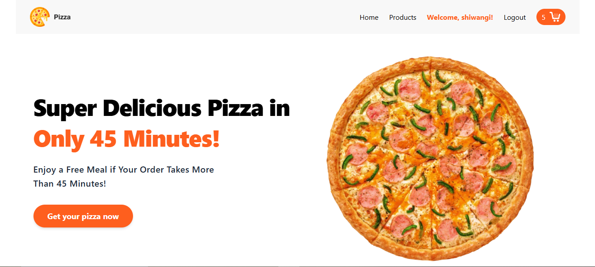
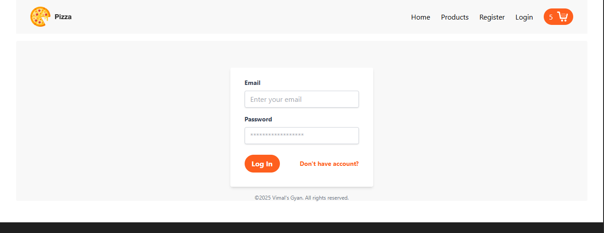
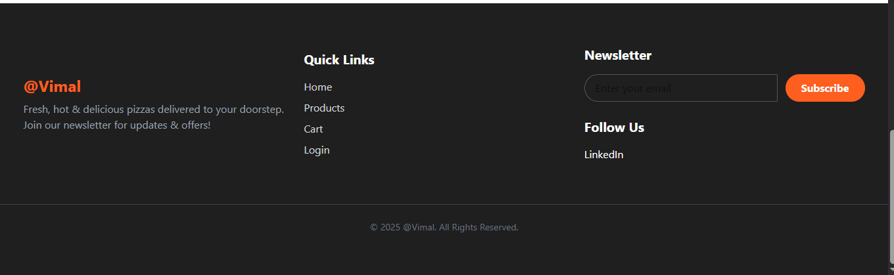

---

# **🍕 MERN Commerce – Full-Stack E-Commerce Application**

A high-performance, full-stack e-commerce application built with **React.js**, **Redux Toolkit**, **Tailwind CSS**, **Node.js**, **Express.js**, and **MongoDB**.
It includes **JWT Authentication**, **Access & Refresh Tokens**, **HTTP-Only cookies**, and **secure protected routes** for Products and Cart.

Deployed live on **Vercel (Frontend)** and **Render/Backend service**.

---

# **🌐 Live Demo**

### **Frontend (Vercel):**

[https://your-vercel-app-url.vercel.app](#)

### **Backend (API Server):**

[https://your-backend.onrender.com](#)

### **Dummy Product API Used:**

```
https://fakestoreapi.com/products
```

(You can replace with your own MongoDB API, but this works as a hosted dummy API.)

---

# **📦 GitHub Repository**

**Frontend GitHub Repo:**

```
https://github.com/your-username/your-frontend-repo
```

**Backend GitHub Repo:**

```
https://github.com/your-username/your-backend-repo
```

---

# **🚀 Features**

### **Frontend**

* Home page
* Product listing page
* Cart page
* Register page
* Login page
* Fully responsive UI with Tailwind
* State management using Redux Toolkit
* Protected routes for Cart & Products
* Access Token (memory) + Refresh Token (HTTP-only cookie) based session

### **Backend**

* Secure user registration & login
* JWT Access Token (short-lived)
* Refresh Token with HTTP-Only cookie
* Login persistence
* Protected APIs
* Mongoose schema structure
* Clean architecture with controllers, routes & middleware

---

# **🛡️ Security Architecture**

### **Authentication Flow**

1. User logs in
2. Backend issues:

   * Access Token (short expiration)
   * Refresh Token stored in HTTP-Only cookie
3. For protected routes:

   * Access Token is validated
4. If expired → Auto-refresh using Refresh Token
5. No need to re-login

This is the **same model used by large-scale production apps**.

---

# **📸 UI Screenshots**

Create a folder named:

```
/screenshots
```

Then add your images.

Example placeholders:

## Application Screenshots

### Home Page


### Product Page


### Home Page (Alternate)


### Cart Page


### Login Page


### Register Page


### Footer Page



---

# **🧰 Tech Stack**

### **Frontend**

* React.js
* React Router
* Redux Toolkit
* Tailwind CSS
* Axios

### **Backend**

* Node.js
* Express.js
* MongoDB
* Mongoose
* JsonWebToken
* Bcrypt
* Cookie-parser

---

# **📁 Project Structure**

### **Frontend**

```
frontend/
  src/
    components/
    pages/
    store/
    utils/
    App.js
    index.js
```

### **Backend**

```
backend/
  controllers/
  routes/
  middleware/
  models/
  config/
  server.js
```

---

# **▶️ How to Run Project Locally**

## **1. Clone Repos**

```bash
git clone https://github.com/your-username/your-frontend-repo
git clone https://github.com/your-username/your-backend-repo
```

---

# **Frontend Setup**

```bash
cd frontend
npm install
npm start
```

---

# **Backend Setup**

```bash
cd backend
npm install
npm start
```

---

# **🔧 Backend Environment Variables**

Create `.env`:

```
PORT=5000
MONGO_URI=your_mongo_connection_string
ACCESS_TOKEN_SECRET=your_access_secret
REFRESH_TOKEN_SECRET=your_refresh_secret
CLIENT_URL=https://your-frontend.vercel.app
```

---

# **🚀 Deployment Guide**

## **Frontend – Deploy on Vercel**

1. Go to [https://vercel.com](https://vercel.com)
2. Import your GitHub repo
3. Vercel auto-detects React
4. Deploy
5. Add environment variable for API URL:

```
REACT_APP_API_URL=https://your-backend.onrender.com
```

---

## **Backend – Deploy on Render / Railway / Vercel**

If on Render:

1. Create new Web Service
2. Connect GitHub backend repo
3. Add env vars
4. Deploy

If using Vercel serverless:

* Use Vercel functions
* Add API folder
* Add environment variables
* Deploy

---

# **📌 API Endpoints**

### **Auth**

```
POST /api/auth/register
POST /api/auth/login
GET  /api/auth/refresh
GET  /api/auth/logout
```

### **Products**

```
GET /api/products
GET /api/products/:id
```

### **Cart (Protected)**

```
POST   /api/cart/add
PATCH  /api/cart/update
DELETE /api/cart/remove
GET    /api/cart/my-cart
```

---

# **📜 License**

This project is MIT Licensed.

---

# **⭐ Show Support**

If this project helps you, star the repo and share it with developers.

---
